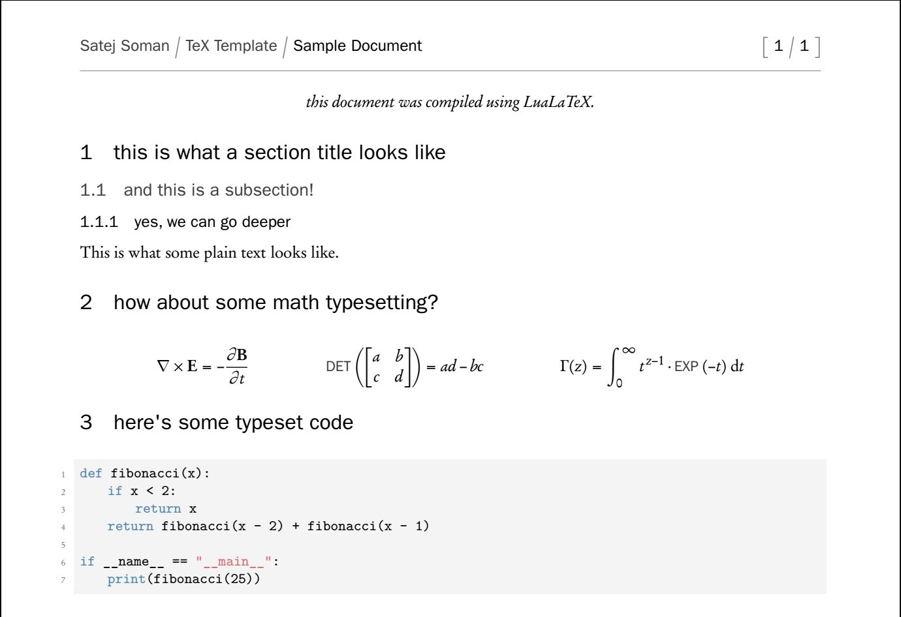

# SaTeX
collection of TeX macros and shortcuts 

including the `commons.tex` file adds in all the defined commands and sets the fonts to custom OTF fonts if the document is compiled with LuaLaTeX (defaults to standard Computer Modern otherwise). 

## custom fonts 
compiled with LuaLaTeX

## classic fonts 
compiled with PDFLaTeX

